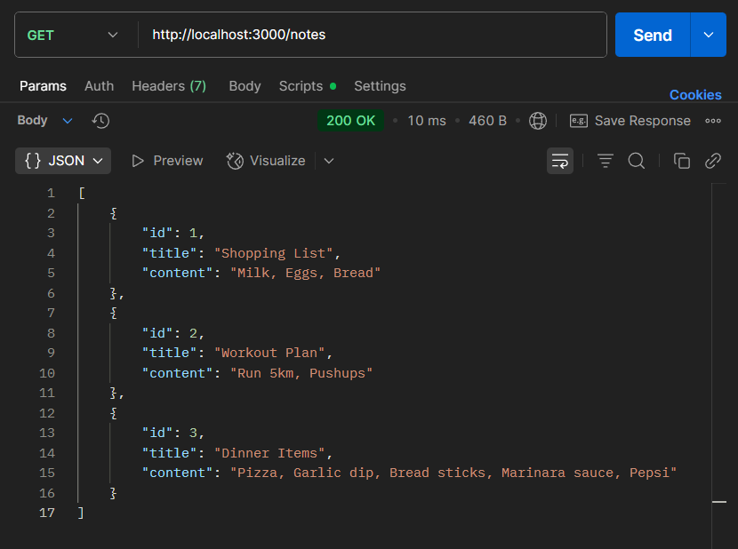
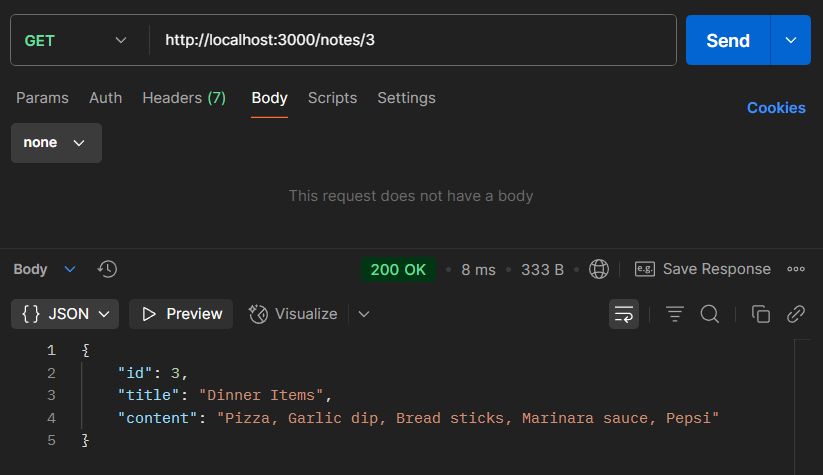
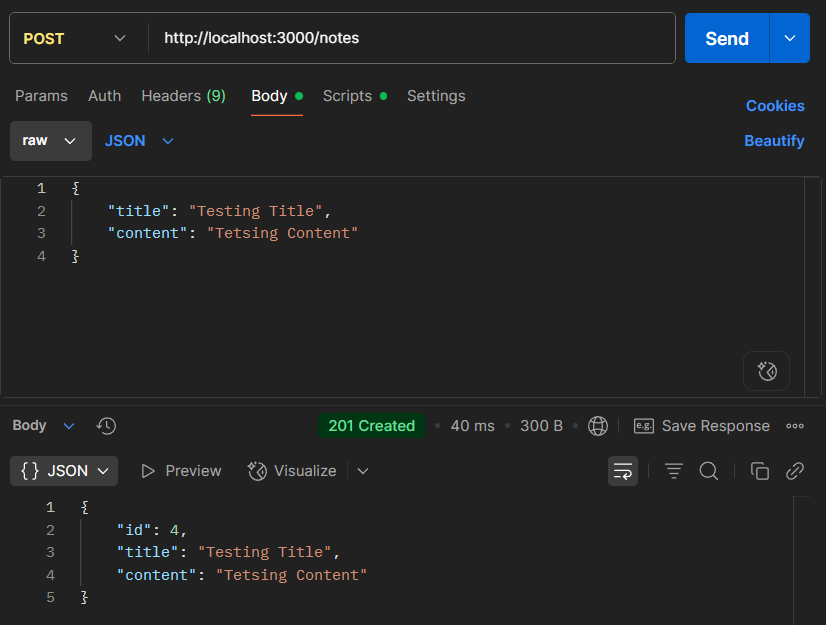
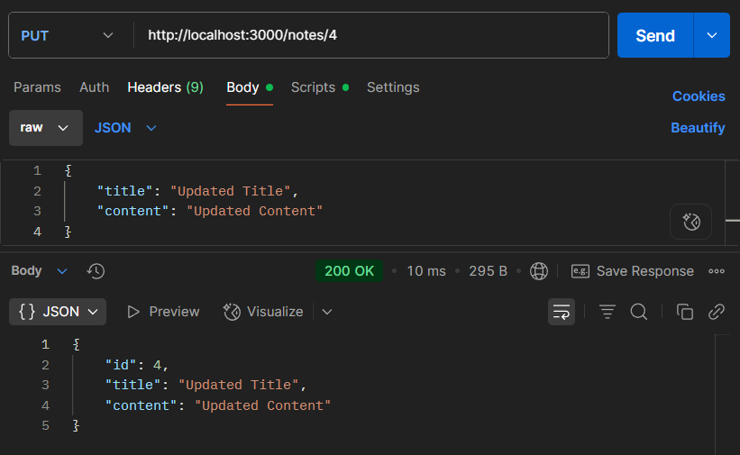
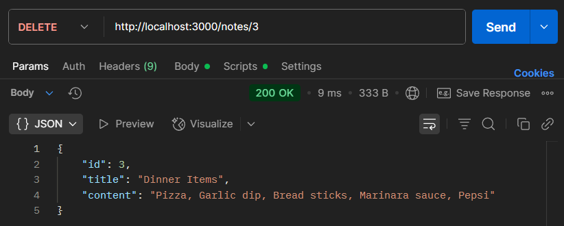

# 📝 Notes API

A simple RESTful API built with **Node.js** and **Express.js** to manage notes.  
This version uses **in-memory storage**, so notes are lost when the server restarts.  
It demonstrates the basics of CRUD operations (Create, Read, Update, Delete).

---

## 🚀 Features
- Get all notes
- Get a single note by ID
- Create a new note
- Update an existing note
- Delete a note
- Error handling for missing or invalid data

---

## 📖 API Endpoints

| Method | Endpoint        | Description               | Request Body Example |
|--------|-----------------|---------------------------|-----------------------|
| GET    | `/notes`        | Get all notes             | - |
| GET    | `/notes/:id`    | Get a single note by ID   | - |
| POST   | `/notes`        | Create a new note         | `{ "title": "Test", "content": "Hello World" }` |
| PUT    | `/notes/:id`    | Update an existing note   | `{ "title": "Updated", "content": "Updated text" }` |
| DELETE | `/notes/:id`    | Delete a note by ID       | - |

---

## ⚠️ Error Handling
- `404 Not Found` – Returned when a note does not exist.
- `400 Bad Request` – Returned when required fields are missing in the request body.

---

## 🧪 Example Usage with Postman

**Get All Notes:**



**Get a Note**



**Create a Note:**



**Update a Note:**



**Delete a Note:**



---

## 📂 Project Setup

1. Clone the repository
   ```
   git clone https://github.com/AryanPatel1918/notes-api
   cd notes-api 
   ```

2. Install dependencies
   ```
   npm install
   ```

3. Start the server
   ```
   node server.js
   ```
   Or, if you use nodemon for auto-restart:
   ```
   npm run dev
   ```

4. The server will run at:
   ```
   http://localhost:3000
   ```
